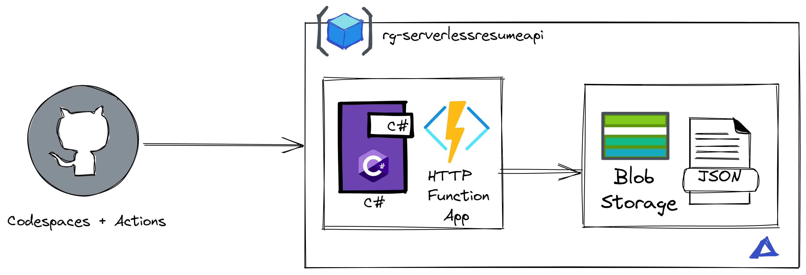

# 🚀Omani's Azure Resume

This is my Cloud Resume Challenge built on Azure. It's a static website hosted on Azure Storage, with a visitor counter built on Azure Functions. The website is built with HTML, CSS, and JavaScript. The visitor counter is built with .NET 8.0 and Azure Functions using the isolated process model.

If you'd like to build your own, here is the YouTube video [video](https://youtu.be/ieYrBWmkfno).


## 📋 Table of Contents

- [🔍 Demo](#-demo)
- [📝 Pre-requisites](#-pre-requisites)
- [🏗️ Structure](#️-structure)
- [⚙️ Setup](#️-setup)
- [🌐 Frontend Resources](#-frontend-resources)
- [⚡ Backend Resources](#-backend-resources)
- [🧪 Testing Resources](#-testing-resources)
- [🔄 CI/CD Resources](#-cicd-resources)
- [📌 TO DO](#-to-do)
- [👥 Contributing](#-contributing)
- [📜 License](#-license)

## 🔍 Demo

[View it live here](https://www.gpsresume.com/)

## 📝 Pre-requisites

I leverage [Dev Containers](https://code.visualstudio.com/docs/remote/containers) for my development environment. If you'd like to use it, you'll need to install [Docker](https://www.docker.com/products/docker-desktop) and the [Dev Containers](https://marketplace.visualstudio.com/items?itemName=ms-vscode-remote.remote-containers) extension for VS Code.

## 🏗️ Structure

- `frontend/`: Contains the website.
    - `main.js`: Contains visitor counter code.
- `api/`: Contains the .NET 8.0 API deployed on Azure Functions.
    - `Program.cs`: Contains the dependency injection setup and DefaultAzureCredential configuration.
    - `CosmosDbService.cs`: Service for interacting with Cosmos DB.
    - `GetVisitorCounter.cs`: Contains the visitor counter code.
- `.github/workflows/`: Contains CI/CD workflow configurations.
- `.devcontainer`: Contains the container configuration for VS Code.

## ⚙️ Setup

1. Make sure Docker is running.
2. Open the project in VS Code.
3. Press `Ctrl/Cmd + Shift + P` to open the command palette.
4. Type "Reopen in Container" and select:
    - [`.NET API`](.devcontainer/api/devcontainer.json) container for working with the Azure Functions backend.
    - [`JS Frontend`](.devcontainer/frontend/devcontainer.json) container for working with the frontend.
    - [`Tests`](.devcontainer/tests/devcontainer.json) container for running tests.
5. VS Code will reload and you'll be in the container.

## 🌐 Frontend Resources

The front-end is a static site with HTML, CSS, and JavaScript. It includes a visitor counter that fetches data via an API call to an Azure Function.

- 🎨 I used this [template](https://www.styleshout.com/free-templates/ceevee/) to create my site.
- 📡 This [article](https://www.digitalocean.com/community/tutorials/how-to-use-the-javascript-fetch-api-to-get-data) explains how to use the JavaScript Fetch API to make an API call.
- 🗄️ [Azure Storage Explorer](https://azure.microsoft.com/features/storage-explorer/) is a handy tool for working with Storage Accounts.
- 🌍 This is how you can [deploy a static site to blob storage](https://docs.microsoft.com/azure/storage/blobs/storage-blob-static-website-host).

## ⚡ Backend Resources

The back-end is an [HTTP triggered Azure Function](https://docs.microsoft.com/azure/azure-functions/functions-bindings-http-webhook-trigger?tabs=csharp) with Azure Cosmos DB integration. The function is built using .NET 8.0 with the isolated process model and uses DefaultAzureCredential for secure authentication to Cosmos DB.

- 🔧 [Create a Cosmos DB account](https://docs.microsoft.com/azure/cosmos-db/create-cosmosdb-resources-portal)
- 🛠️ [Create an HTTP triggered Azure Function in Visual Studio Code](https://docs.microsoft.com/azure/azure-functions/functions-develop-vs-code?tabs=csharp)
- 🔌 [Azure Functions Cosmos DB bindings](https://docs.microsoft.com/azure/azure-functions/functions-bindings-cosmosdb-v2)
- 📤 [Enable CORS with Azure Functions locally](https://learn.microsoft.com/azure/azure-functions/functions-develop-local#local-settings-file) and once it's [deployed to Azure](https://docs.microsoft.com/azure/azure-functions/functions-how-to-use-azure-function-app-settings?tabs=portal#cors).
- 🔐 [DefaultAzureCredential documentation](https://learn.microsoft.com/dotnet/api/azure.identity.defaultazurecredential)

### 🔑 Authentication

The application uses DefaultAzureCredential to authenticate with Azure Cosmos DB. This simplifies credential management by supporting multiple authentication methods and improves security by eliminating the need for connection strings with sensitive keys.

#### 💻 Local Development

1. Copy `api/local.settings.json.template` to `api/local.settings.json`
2. Set the `CosmosDbEndpoint` to your Cosmos DB endpoint URL
3. For local authentication, you can use:
   - **Azure CLI**: Sign in with `az login` before running the application
   - **Azure Developer CLI**: Sign in with `azd auth login` before running the application
   - **Visual Studio**: Use Visual Studio authentication
   - **Service Principal**: Set `AZURE_TENANT_ID`, `AZURE_CLIENT_ID`, and `AZURE_CLIENT_SECRET` environment variables

The DefaultAzureCredential will automatically detect and use credentials from the development environment.

#### ☁️ Azure Deployment

When deployed to Azure Functions, the app will use the Function App's managed identity:

1. Enable system-assigned managed identity on your Function App
2. Grant the managed identity appropriate permissions on your Cosmos DB account
3. Configure the app setting in your Function App:
   - `CosmosDbEndpoint`: Your Cosmos DB endpoint URL
   - `CosmosDbDatabaseName`: Your database name (e.g., "AzureResume")
   - `CosmosDbContainerName`: Your container name (e.g., "Counter")

## 🧪 Testing Resources

[Testing is important](https://dev.to/flippedcoding/its-important-to-test-your-code-3lid). Though my tests are simple, they exist. I am using .NET but some of these resources will apply to any language.

- 📚 [Getting Started with xUnit.net](https://xunit.net/docs/getting-started/netcore/cmdline)
- 🧩 [Testing Azure Functions](https://techcommunity.microsoft.com/t5/fasttrack-for-azure/azure-functions-part-2-unit-and-integration-testing/ba-p/3769764)

## 🔄 CI/CD Resources

- 🚢 [Deploy a blob storage static site with GitHub Actions](https://docs.microsoft.com/azure/storage/blobs/storage-blobs-static-site-github-actions)
- 🔄 [Deploy an Azure Function to Azure with GitHub Actions](https://github.com/marketplace/actions/azure-functions-action)
- ✅ [Implement .NET testing in GitHub Actions](https://docs.github.com/en/actions/guides/building-and-testing-net)

## 📌 TO DO

- 🔄 Implement tests into CI/CD.
- 🏗️ Create IaC files.
- 📝 Improve tests and tests documentation.

## 👥 Contributing

Contributions are welcome! Please read the [contributing guidelines](CONTRIBUTING.md) first.

## 📜 License

This project is licensed under the MIT License - see the [LICENSE](LICENSE) file for details.
=======
# Your Resume API on Azure Serverless

Create an [API](https://learn.microsoft.com/training/modules/build-api-azure-functions/3-overview-api) with Azure Function that displays your resume information in json. 

## Architecture 



- GitHub for Version control.
- [GitHub Actions](https://docs.github.com/en/actions) for CI/CD pipeline.
- [Azure Functions](https://learn.microsoft.com/en-us/azure/azure-functions/functions-overview) to deploy our API.
- Azure Blob Storage to store our resume.
- .NET 6 as our programming framework for our API.
- Optional: [GitHub Codespaces](https://docs.github.com/en/codespaces/overview) as our development environment. 
- [Bicep](https://learn.microsoft.com/en-us/azure/azure-resource-manager/bicep/overview?tabs=bicep) for our Infrastructure as Code.

## You'll need

- [Azure account](azure.com/free)
- [GitHub account](github.com/join)
- I've provided a sample .json file based on the [Json resume](https://jsonresume.org/schema/)

For local developer environment

- VS Code
- Docker
- [VS Code Dev Container Extension](https://code.visualstudio.com/docs/devcontainers/tutorials)

> **NOTE**
> At the moment, GitHub Free for personal accounts comes with 15 GB of Codespaces storage and 120 Core hours per month. Read more about [pricing here](https://docs.github.com/billing/managing-billing-for-github-codespaces/about-billing-for-github-codespaces)

## How to get started

### Get the code and environment

1. [Fork the repository](https://docs.github.com/pull-requests/collaborating-with-pull-requests/working-with-forks/about-forks) so you can have your own copy of it. 
2. FOR CLOUDSPACES: Click on the `Code` button, click on `Codespaces` tab, and click on `Create Codespaces on main`. I've provided a [`devcontainer.json`](https://code.visualstudio.com/docs/devcontainers/create-dev-container) file with the configuration needed for this project.
3. Once your Codespace has loaded, in the Explorer, expand the `src` folder and rename `local.settings.sample.json` to `local.settings.json`
4. FOR LOCAL DEV: Clone the code, open it with VS Code and Launch in the dev container. More info [here](https://code.visualstudio.com/docs/devcontainers/containers)

### Authenticate your Environment with Azure
1. In the Terminal, type `az login --use-device-code` to log into your Azure account from the az cli in your Codespace.
2. In the Terminal, type `az account list --output table` to get a list of Azure subscriptions you have available to you and make note of the name you want to use. 
3. In the Terminal, type `az account set --name "name-of-subscription"` with the name of the subscription you want to use.
4. In the Terminal, type `az account show` and make sure it's set to the subscription you want to work in.

### Provision resources in Azure

> **NOTE:** I've set the resource group name to be `rg-serverlessresumeapi`

1. I've provided Infrastructure as Code (IaC) files, you can find them in the `infra` folder. Now we need to use those files to create a deployment in Azure, in the Terminal, type: 
    ```sh
    az deployment sub create --template-file ./infra/main.bicep -l <your-region>   
    ```
2. In the Terminal, run the following command to see the values for your storage account name and function:
    ```sh
    az deployment group show -g rg-serverlessresumeapi -n resources --query properties.outputs 
    ```
3. Now let's save that output into individual variables. Run the Azure CLI command and capture the output:
    ```sh
    output=$(az deployment group show -g rg-serverlessresumeapi -n resources --query properties.outputs)
    ```
4. Since the output has several values, we need to arse the output and store each value in a variable
    ```sh
    functionAppName=$(echo $output | jq -r '.functionAppName.value')
    functionUri=$(echo $output | jq -r '.functionUri.value')
    storageAccountName=$(echo $output | jq -r '.storageAccountName.value')
    ```
5. Now we can Echo (print to screen) the variables to verify
    ```sh
    echo "Function App Name: $functionAppName"
    echo "Function URI: $functionUri"
    echo "Storage Account Name: $storageAccountName"
    ```
6. Upload `myresume.json` to that newly created blob container. 
    ```sh
    az storage blob upload --account-name $storageAccountName --container-name resume --name myresume.json --file myresume.json 
    ```
7. In your `local.settings.json` add the Storage Account Connection String to the `AzureWebJobsStorage` value. You can get that value by running this command: 
    ```sh
    az storage account show-connection-string --name $storageAccountName --resource-group rg-serverlessresumeapi   
    ```
8. You can now run and debug (F5) your Function in your environment or run this command in the terminal: 
    ```sh
    cd src
    func start host
    ```

## Configure CI/CD with GitHub actions

1. In the .github folder, edit your `build.yml` and update the `AZURE_FUNCTIONAPP_NAME` value with the name of your function app.
2. We'll need to get our Function's Publish Profile, run the following command in the terminal and copy the output:
    ```sh
    az functionapp deployment list-publishing-profiles --name $functionAppName --resource-group rg-serverlessresumeapi --xml
    ```
3. In your GitHub repo, go to settings > secrets and variables > actions > create a secret named `AZURE_FUNCTIONAPP_PUBLISH_PROFILE` with the contents of your publish profile you just copied.
4. Head to Actions tab on your Repo and manually run the workflow. 
5. Once it's complete. Your resume api is now in production. We can view it in 3 ways:
    - Using curl in the terminal: 
        ```sh
        curl $functionUri/getresume
        ```
    - Using the browser: open a new tab with your function URI and add `/api/getresume` at the end.
    - Use the thunderclient extension in VS Code with your function URI and add `/api/getresume` at the end.
        
>>>>>>> bdacfb84d12c07327c05ec130bb992be662edcea
